# 📚 BiblioStock

Sistema de gestión bibliotecaria 

## 📖 Descripción del Programa

BiblioStock es un sistema de gestión bibliotecaria desarrollado para administrar el inventario de libros y el control de préstamos dentro de una biblioteca.

El programa permite:

- Registrar nuevos libros.
- Consultar la información de los libros almacenados.
- Actualizar datos de un libro existente.
- Eliminar registros de libros.
- Gestionar préstamos y devoluciones.
- Almacenar la información de manera persistente mediante archivos JSON.

## 👥 Integrantes

| Integrante | Rol | Rama Principal |
|------------|------|----------------|
| Angie | Integradora del repositorio | main |
| Juan | Gestión de inventario | feature/prestamos |
| Sofa | Gestión de préstamos | feature/gestion-inventario |
| Zirley | Persistencia JSON | feature/persistencia-json |

## ⚙️ Módulos del Sistema

### 📚 Inventario
Permite registrar, consultar, actualizar y eliminar libros del inventario.

### 🔄 Préstamos
Gestiona el préstamo y devolución de libros por parte de los usuarios.

### 💾 Persistencia JSON
Permite guardar y cargar la información del sistema utilizando archivos JSON.

## 🛠️ Instalación, configuración y repositorio local

Al inicio del proyecto, cada uno instaló Git en su equipo y configuró su identidad mediante los comandos `git config --global user.name` y `git config --global user.email`.

Esta configuración permitió que cada colaborador quedara registrado en el historial del repositorio, identificando al autor de cada commit. Con git config --list se verifico que la informacion tanto de user como el email estuvieran correctamente configuradas

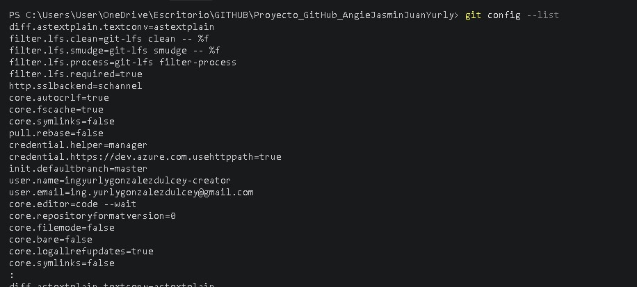

El repositorio local se creo al inicio del proyecto utilizando, el comando git init se uso para convertir la carpeta de BiblioStock en un repositorio Git y comenzar el control de versiones del código

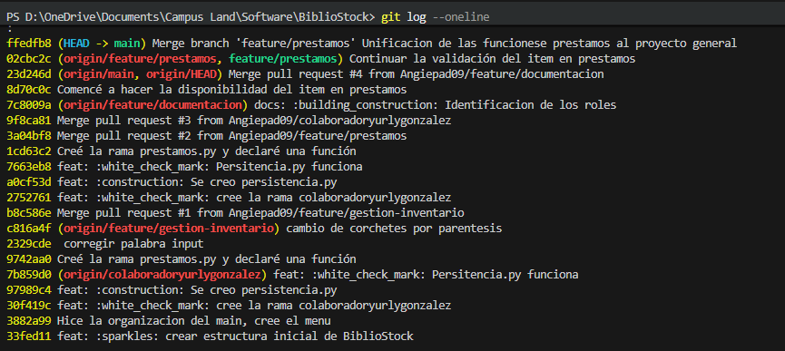

## Repositorio web

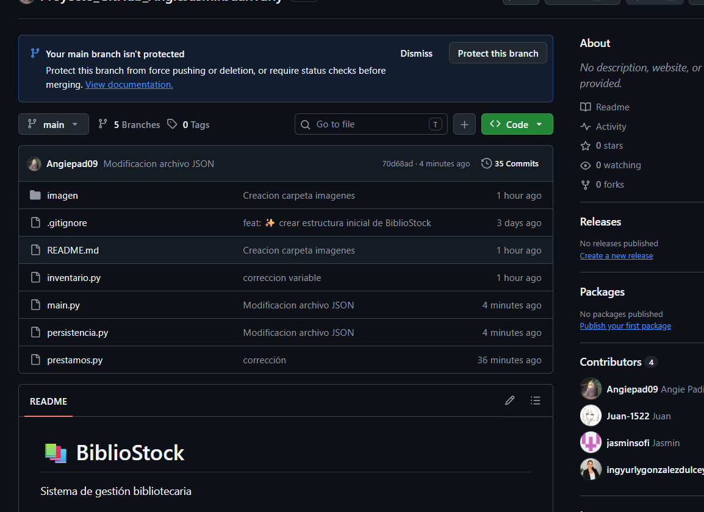

### Terminal con remote -v 

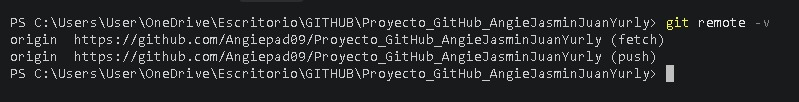

Clonacion del respositorio 

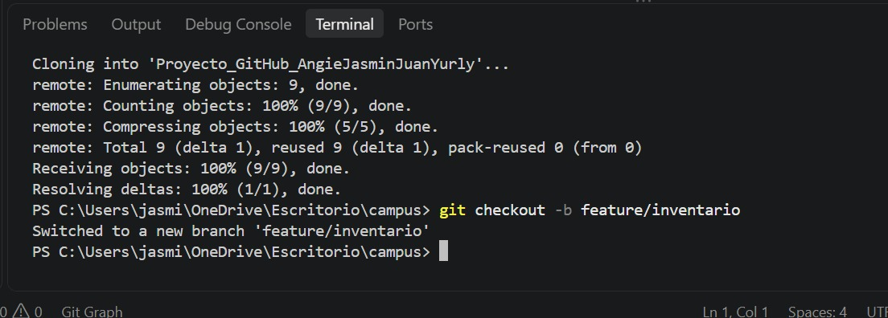

## 🔄 Proceso de Integración y Merges

### Ramas creadas en el proyecto
Se uso Git branch -a para ver todas tanto locales como remotas

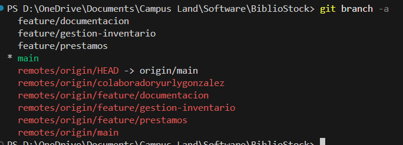

### Uso del comando  git log --oneline --graph --all
Se uso para visualizar como se funcionaron las ramas hacia el main

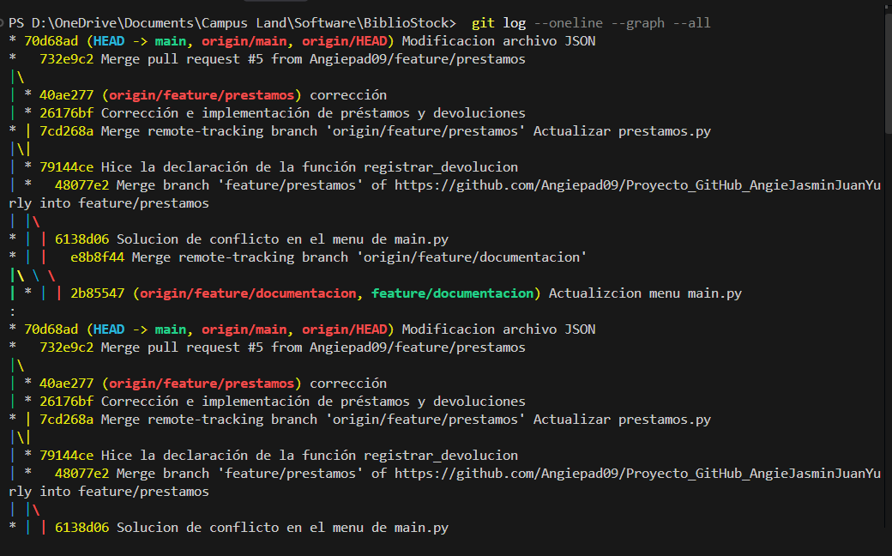

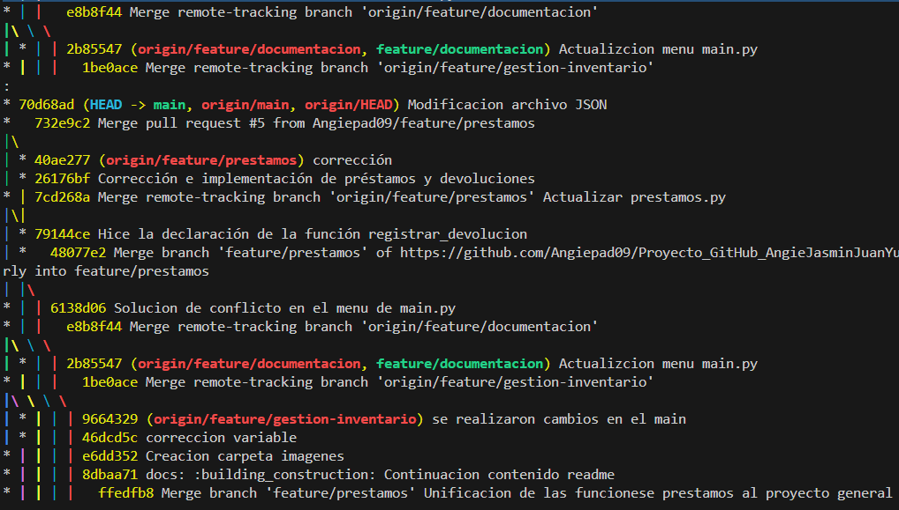

Proposito de la rama feature 
Se utilizo la rama feature/* para implementar nuevas funcionalidades independientes y facilitar el trabajo colaborativo. No se crearon mas ramas, debido a que los errores detectados fueron corregidos directamente dentro de las ramas.

## Commits, sincronización y resolución de conflictos

### Conventional Commits
git log se uso para ver el historial de los commits realizados

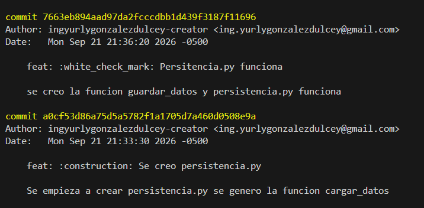

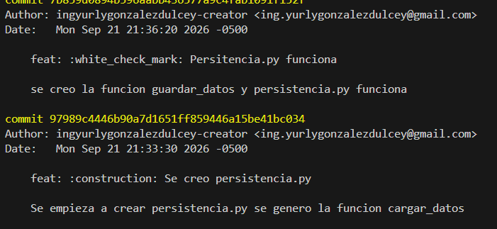

Los comandos git pull y git push se usan para sincronizar tanto localmente como remotamente
Especficamente el pull es para "traer" las modificaciones alojadas en el repositorio remoto
El push es para "mandar" las modificaciones locales al repositorio remoto

### Sincronización entre integrantes

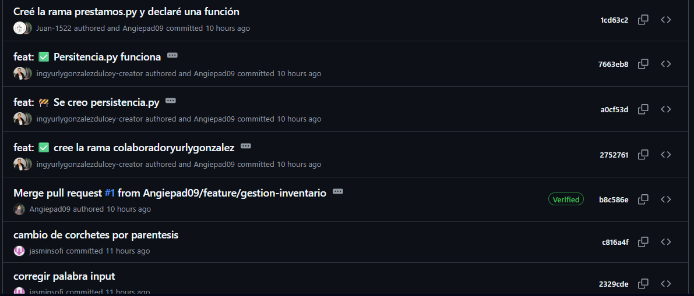

### Conflicto de merge resuelto

El conflicto ocurrió porque dos integrantes modificaron la misma parte del código en ramas diferentes. Cuando intentamos hacer el merge, Git no pudo decidir automáticamente qué cambio conservar. Entonces revisamos las dos versiones y usamos Incoming Change decidiendo conservar los cambios que venían de la otra rama. Después de resolverlo, guardamos los cambios, hicimos el commit y verificamos que el proyecto funcionara correctamente

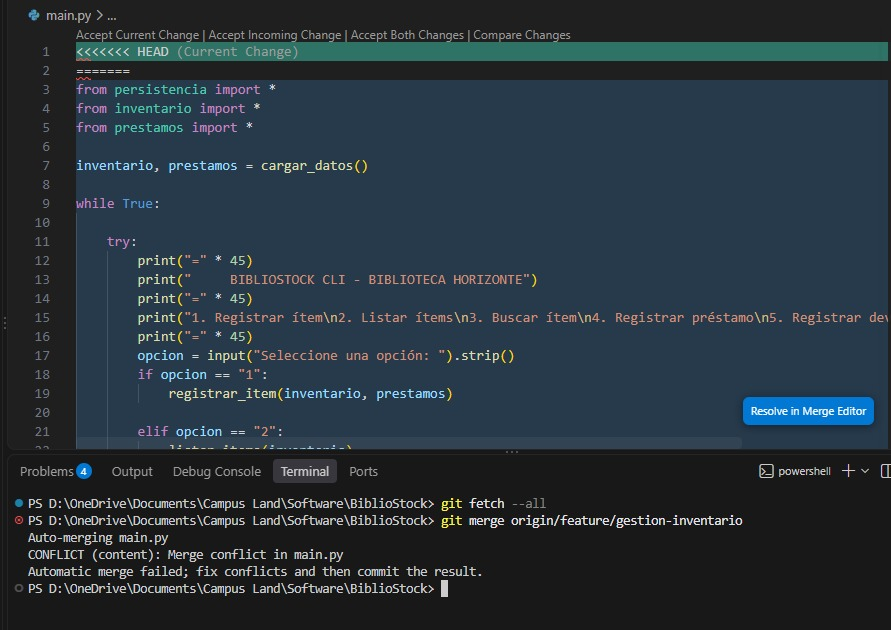

### Uso de .gitignore

Solamente se excluyo la carpeta __pycache__ ya que es cache, y es inncesario para el funcionamiento del proyecto. Este se crea cada vez que se ejecuta el programa

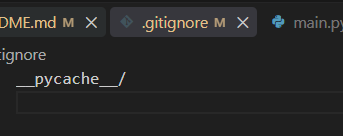

## Colaboración en GitHub

<table>
  <tr>
    <td width="50%">
      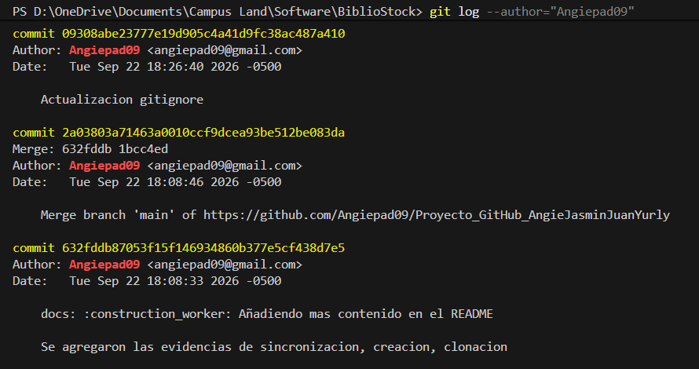
    </td>
    <td width="50%">
      <b>Commits Angie</b> 
      Mi parte fue la creacion del proyecto principal, la estructura del proyecto junto con los archivos que se usaron, tambien al ser el propietario del repositorio, fui quien reviso los commits y los aprobo, ademas de la creacion del README
    </td>
  </tr>
</table>

<table>
  <tr>
   <td width="50%">
      <b>Commits Jasmin</b> 
      Mi parte del proyecto fue la gestión del inventario. Básicamente, me encargué de la parte donde se organizan y controlan los libros y materiales que tiene la biblioteca.Lo que hice fue permitir que se pueda agregar, consultar, modificar y eliminar la información de los materiales. 
      También sirve para saber cuáles están disponibles y cuáles no.La idea principal es que la biblioteca pueda tener toda la información del inventario más organizada y sea mucho más fácil llevar el control de los materiales.
    </td>
     <td width="50%">
      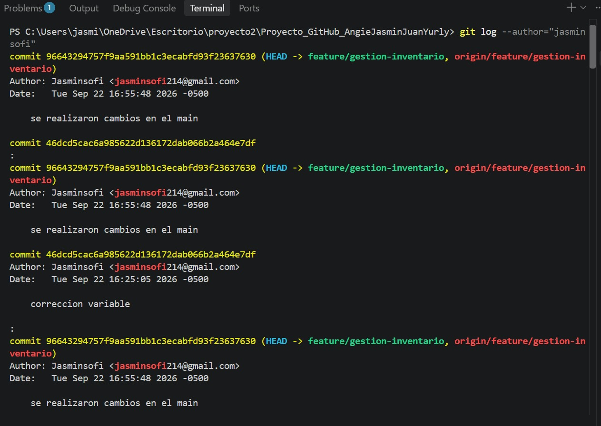
    </td>
  </tr>
</table>

<table>
  <tr>
    <td width="50%">
      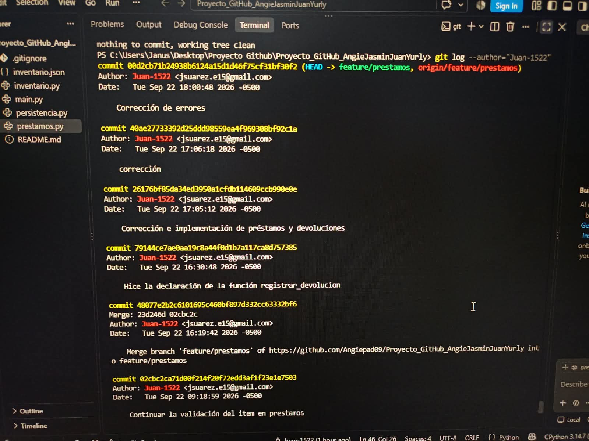
    </td>
    <td width="50%">
      <b>Commits Juan</b> 
      Mi parte del proyecto es la del módulo de préstamos y devoluciones, la dos funciones registran el préstamo y la devolución del ítem, primero solicitando al usuario el código del ítem, usuario y fecha del préstamo. Después busca el ítem dentro del inventario comprobando que exista y que todavía tenga unidades disponibles, si hay una unidad disponible entonces se reduce la cantidad del disponible en 1 y se crea el registro.
      También se registra la devolución que es parecida a lo anterior, el programa solicita el código del ítem, el usuario y busca el préstamo que coincida con esos datos. Si encuentra un préstamo activo entonces cambia el "devuelto" a True y aumenta nuevamente en 1 la cantidad disponible del ítem. 
      De esta manera los registros quedan guardados para que cualquier usuario que quiera hacer la prestación de un libro o su devolución quede registrada y validada de que se realizó.
    </td>
  </tr>
</table>

<table>
  <tr>
   <td width="50%">
      <b>Commits Yurly</b> 
      Básicamente este archivo es el que guarda todo. Si no fuera por esto, cada vez que cerramos el programa se borraría el inventario.
      ARCHIVO_DATOS = "datos.json" Es el archivo donde se va a guardar todo.
      cargar_datos()
      Esta función es la que se ejecuta al principio.
        Lo que hace es revisar si el datos.json ya existe:
        - Si no existe, devuelve dos listas vacías para empezar de cero.
        - Si sí existe, lo abre y saca lo que hay en inventario y prestamos.
        Le puse el try/except por si el archivo está vacío o se daña, para que no se caiga el programa y simplemente empiece vacío.
        guardar_datos()Esta es para guardar. Cada vez que agregamos un libro o un préstamo, esta función coge las dos listas y las guarda en el datos.json. Le puse indent=4 para que el archivo se vea bonito y ordenado y no todo pegado. 
    </td>
     <td width="50%">
      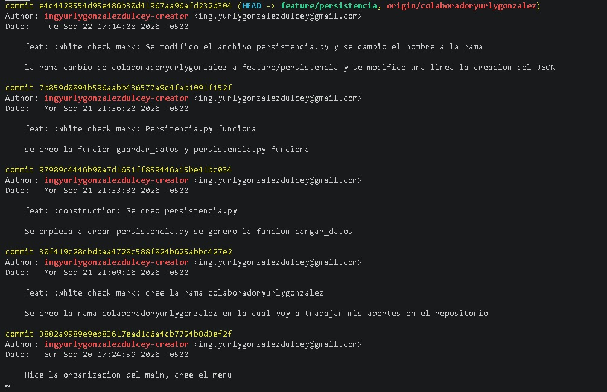
    </td>
  </tr>
</table>

## 🔗 Repositorio GitHub

https://github.com/Angiepad09/Proyecto_GitHub_AngieJasminJuanYurly

