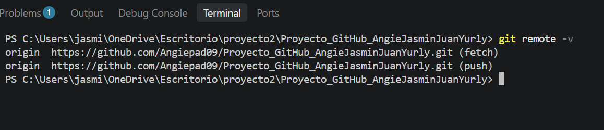
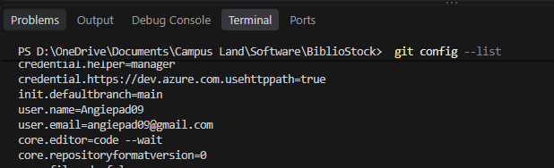
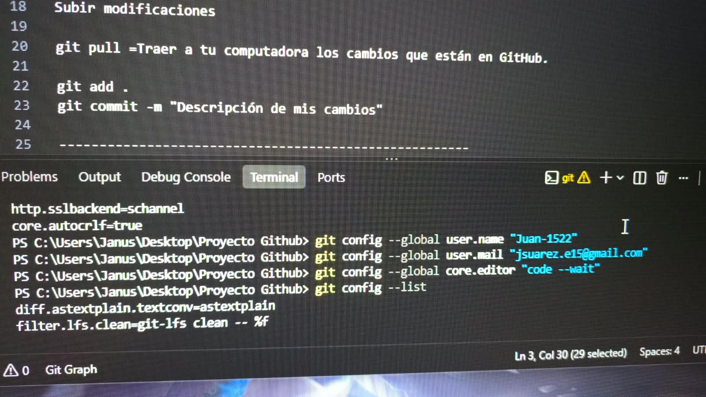

# 📚 BiblioStock

Sistema de gestión bibliotecaria 

## 📖 Descripción del Programa

BiblioStock es un sistema de gestión bibliotecaria desarrollado para administrar el inventario de libros y el control de préstamos dentro de una biblioteca.

El programa permite:

- Registrar nuevos libros.
- Consultar la información de los libros almacenados.
- Actualizar datos de un libro existente.
- Eliminar registros de libros.
- Gestionar préstamos y devoluciones.
- Almacenar la información de manera persistente mediante archivos JSON.

## 👥 Integrantes

| Integrante | Rol | Rama Principal |
|------------|------|----------------|
| Angie | Integradora del repositorio | main |
| Juan | Gestión de inventario | feature/prestamos |
| Sofa | Gestión de préstamos | feature/gestion-inventario |
| Zirley | Persistencia JSON | feature/persistencia-json |

## ⚙️ Módulos del Sistema

### 📚 Inventario
Permite registrar, consultar, actualizar y eliminar libros del inventario.

### 🔄 Préstamos
Gestiona el préstamo y devolución de libros por parte de los usuarios.

### 💾 Persistencia JSON
Permite guardar y cargar la información del sistema utilizando archivos JSON.

## 🛠️ Instalación, configuración y repositorio local

Al inicio del proyecto, cada uno instaló Git en su equipo y configuró su identidad mediante los comandos `git config --global user.name` y `git config --global user.email`.

Esta configuración permitió que cada colaborador quedara registrado en el historial del repositorio, identificando al autor de cada commit. Con git config --list se verifico que la informacion tanto de user como el email estuvieran correctamente configuradas

El repositorio local se creo al inicio del proyecto utilizando el comando git init. Esto permitió convertir la carpeta de BiblioStock en un repositorio Git y comenzar el control de versiones del código

## Repositorio web

Terminal con remote -v 

Clonacion del respositorio 

## 🔄 Proceso de Integración y Merges

Ramas creadas en el proyecto

Uso del comando  git log --oneline --graph --all

Proposito de la rama feature 
Se utilizo la rama feature/* para implementar nuevas funcionalidades independientes y facilitar el trabajo colaborativo. No se crearon mas ramas debido los errores detectados fueron corregidos directamente dentro de las ramas.

## Commits, sincronización y resolución de conflictos

Conventional Commits

 Sincronización entre integrantes

## 🚫 Uso del Archivo .gitignore

## 📸 Evidencias del Proyecto

### Configuración de Git
[Captura]

### Creación de ramas
[Captura]

### Commits realizados
[Captura]

### Push y Pull
[Captura]

### Merge de ramas
[Captura]

### Resolución de conflictos
[Captura]

## 🔗 Repositorio GitHub

